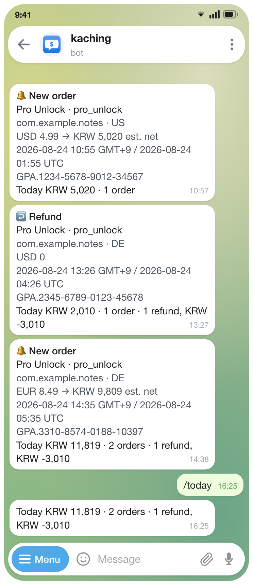

# Kaching

A Chrome extension that sends you a Telegram message when your Google Play
developer account takes a new order or a refund.

No server, no account, nothing to set up per app. It runs in your browser using
the Play Console session you are already signed in to.

<p align="center">
  
</p>

Send the bot `/today`, `/week` (from Sunday) or `/month` — they appear in the
bot's own command menu, so there is nothing to memorise.
Answers come back within a second or two: a separate one-minute alarm holds a
long poll open on Telegram, so a command is usually waited for rather than
looked for.

The tally is written one message at a time, so two commands exist for the day you
notice it is wrong. `/recount` fetches from Play again and **writes the result
back**, so `/today` changes with it. `/adjust` patches a day by hand instead:

```
/recount                      everything Play still has
/recount today                just today
/recount 6                    June of this year
/recount 6월                  the same
/recount 08-20                the 20th of August this year
/recount 2026-08              a whole month
/adjust -6500                 today, down by 6,500
/adjust +5000                 today, up by 5,000
/adjust 2026-08-20 -6500      an earlier day
```

An order reads as five lines — what kind of sale, what sold and from which app,
for how much and where, which order, and when — with the day's running total
under it:

```
구독 4회차
com.example.app, premium_unlock
IN, INR 399, KRW 4,600
GPA.1111-2222-3333-44444..2
2026-08-23 11:01 GMT+9
오늘 11건 · KRW 56,671 · 환불 2건 KRW -9,100
```

## Asking in plain words

The fixed commands answer fixed questions. Put an API key in the settings
and anything else you type is answered too — no prefix, no menu entry to find:

```
최근 일주일간 일별 수익
→ 8월 19일 12,000원 · 20일 0원 · 21일 45,500원 …

그럼 지난달은?

8월 구독 갱신은 몇건이고, 수익은 얼마인지 알려줘
→ 갱신 36건, 161,000원 (환불 1건 -4,600원)
```

It reads the tally four ways: day by day (or by week, month or year), split by
the currency the buyer paid in, split by whether each sale was a one-off
purchase, a new subscription or a renewal, and those last two crossed with how
often the subscription bills — so "August's new monthly subscriptions" is one
figure rather than two that have to be combined. It can also say what the
subscriptions on record are due to bill in a month still to come, which is a
ceiling and says so: it cannot see a cancellation.

Anything outside that — a figure per app or per product, a country rather than a
currency, why a number moved — it says it cannot answer rather than assembling
one out of parts that were not measured together. That rule is why the grouping
and the crossing are done here rather than left to the model: asked to combine
two lists itself, it took an amount from one and a count from the other.

The last four exchanges are kept for half an hour, which is what lets the second
question mean anything. After that a question stands on its own again. `/compact`
boils what has been said so far down to a recap and shows it to you — the thread
carries on from that instead of from the full exchanges, so it keeps its subject
without keeping its bulk.

It reads the same tally `/today` answers from and cannot write to it, so the
worst it can do is say something wrong — and it is asked to quote the figures it
read, so you can check the sentence against them. Anything starting with `/` that
is not a command it knows is left alone, so a mistyped command is not paid for.

What leaves the browser is what you typed and the daily figures needed to answer
it — amounts, order and refund counts, one row per day — sent to whichever
service you pointed it at, on your key and your bill. With no key set the bot
answers commands and nothing else, exactly as before.

The service is a URL, not a brand: anything speaking the OpenAI
chat-completions API works. It ships pointed at OpenAI, the account most
people already have; DeepSeek, OpenRouter and a model running on your own
machine are the same three fields. Chrome asks permission the first
time you point it somewhere new.

In a private chat that is only what you type. **In a group, check what Telegram
is handing the bot before you set a key.** Privacy mode is on by default and
delivers only commands, @mentions and replies to the bot's own messages — so
replying to an order message with "이 날 얼마였지?" works and the rest of the
conversation never reaches it. That stops being true if the bot is made a group
administrator, or if privacy mode is turned off in @BotFather: then the whole
group's chatter goes to that service on your key, and nothing here rate-limits it.

The orders themselves are what is kept — one storage entry per month, roughly
435 bytes an order — and every figure the bot reports is folded out of them when
it is asked for. Nothing is stored as a running total, so a payout Play settles
later, a refund, or a question nobody had thought of yet is answered by reading
the orders again rather than by patching a number that cannot be recomputed. It
is also why `/recount` cannot damage anything: it merges by order ID and never
removes, so a page Play hands back short refreshes fewer orders and nothing else.

One time zone decides everything about a day: which one an order is filed
under, when `/today` starts over, and which window `/recount` asks Play for.
It defaults to the browser's own and is a setting because that machine is not
always where you are — and because a UTC tally is a legitimate thing to want,
since UTC is what the Play Console reports.

That is also why the order line can be made to carry two clocks: the left one
is the day the running total beneath it belongs to, the right one is the day the
Console will show for the same order. It is off by default — one instant written
twice is a line that gets skipped rather than read. Change the zone after orders
are counted and the days already filed keep the old one — Reset, then
`/recount`.

`/recount` on its own fetches everything again; give it a period to narrow it —
`today`, `20` for this month's twentieth, `08-20` for this year, `2026-08-20`,
`2026-08` for a month, `2026` for a year. It counts **everything Play still
shows** for those days, not only what was announced, so it is also how history
that predates the install gets into the books. Two things it will not do: a day
it finds nothing for is reported and left alone rather than zeroed, and if the
response came back full it names the oldest day and leaves that one too, since
it may have arrived in part. An order it counts is marked as delivered so the
next check cannot announce it and count it twice — which does mean a recount
run in the same minute as a sale can swallow that one notification.

`/adjust` keeps its corrections apart from the tally and they are read together
with it — until a `/recount` of that day supersedes them.

## Settings

| Setting | Default | |
|---|---|---|
| Bot token / chat ID | — | Created in @BotFather; **Find chat ID** fills the second |
| Console URL | — | Paste it; the developer ID is read out of it |
| New orders / refunds | both on | Which events to announce |
| Only these apps | all | Package names |
| Minimum payout | 0 | Set 1 to hide zero-value test orders |
| Time zone | this browser's | The day an order counts under, and when `/today` resets |
| Zone time / UTC | zone only | Turn on UTC to get both on one line, for reconciling with the Console |
| Tax and fee breakdown | off | Adds a line so the estimated net figure can be checked |
| Day's running total | on | Footer on every order message — the bot commands work either way |
| API key | — | Optional; lets the bot answer anything that is not a command |
| API base URL | `https://api.openai.com/v1` | Any OpenAI-compatible service |
| Model | `gpt-4o-mini` | Whatever that service calls it |
| Check every | 10 min | Only runs while Chrome is open |
| Deliver on a schedule | off | On, the messages are held and sent in one batch: starts at 05:00, every 24 h is one message a day at five. The tally never waits either way |
| Pause delivery | off | Stops the order messages only — failure alerts still come through |
| Look back | 2 days | How far back each check reads |
| Sender label | — | Prefixed to every message, for a shared chat |

The first run records what is already there without notifying, and banks it at
zero so the totals start from your install rather than from your first ever
sale; only new orders are announced after that. Send `/recount` once if you want
that history in the figures.

## How it works

**There is no API for this.** The Play Developer API has no endpoint that
enumerates new orders — every purchase lookup demands a token or order ID you
already hold, and the only time-ranged sweep is the voided-purchases list.
Real-time Developer Notifications are the one push channel, but every app must
be registered by hand in Play Console with no API to confirm it, so a missed app
fails silently.

**The page cannot be scraped.** The first version read the orders page and
returned nothing. The parser was not the reason:

```
tab hidden   → 0 rows
tab visible  → 25 rows
```

Play Console does not render the order table while the tab is hidden, and
waiting does not help. Anything built on a background tab returns an empty list
forever.

**So it calls the API the Console itself uses.** `orders:fetch` on
`playconsolemonetization-pa.clients6.google.com`, authenticated with the same
`SAPISIDHASH` scheme the Console page uses. No rendering involved. See
`extension/playconsole.js` for the request and the response field mapping.

## Reliability

A notifier that dies quietly is indistinguishable from a quiet sales day, so
this one reports its own failures: three consecutive failures trigger a Telegram
message. Recovery is not announced unless you ask for it — it is the one message
here that reports nothing happening, and by the time it lands you have usually
seen the orders start arriving again. Delivery failures count the same as read
failures — a revoked bot token leaves the read path healthy, so ignoring it would
mean no signal at all.

Delivery is at-least-once. Each order is recorded the moment it is sent rather
than at the end of a batch, so an error partway through does not re-announce
what already arrived. If the worker dies between Telegram's response and the
write, that one order repeats. A duplicate beats a miss.

The settings page keeps a 200-entry activity log — checks, messages, failures,
recoveries. It never leaves the machine.

## Development

```bash
node --test tools/extension.test.mjs   # unit tests
./tools/package.sh                     # builds dist/kaching-<version>.zip
```

The chat mockup above is `docs/telegram.html`, rendered headless — sample data
only, no real order IDs:

```bash
chrome --headless --allow-file-access-from-files --force-device-scale-factor=2 \
       --window-size=372,856 --screenshot=docs/telegram.png docs/telegram.html
```

Packaging verifies that every manifest reference and relative import is present
in the zip; a module left out loads fine unpacked and only fails after upload.

## License

[MIT](LICENSE) · Not affiliated with Google, Google Play, or Telegram.
